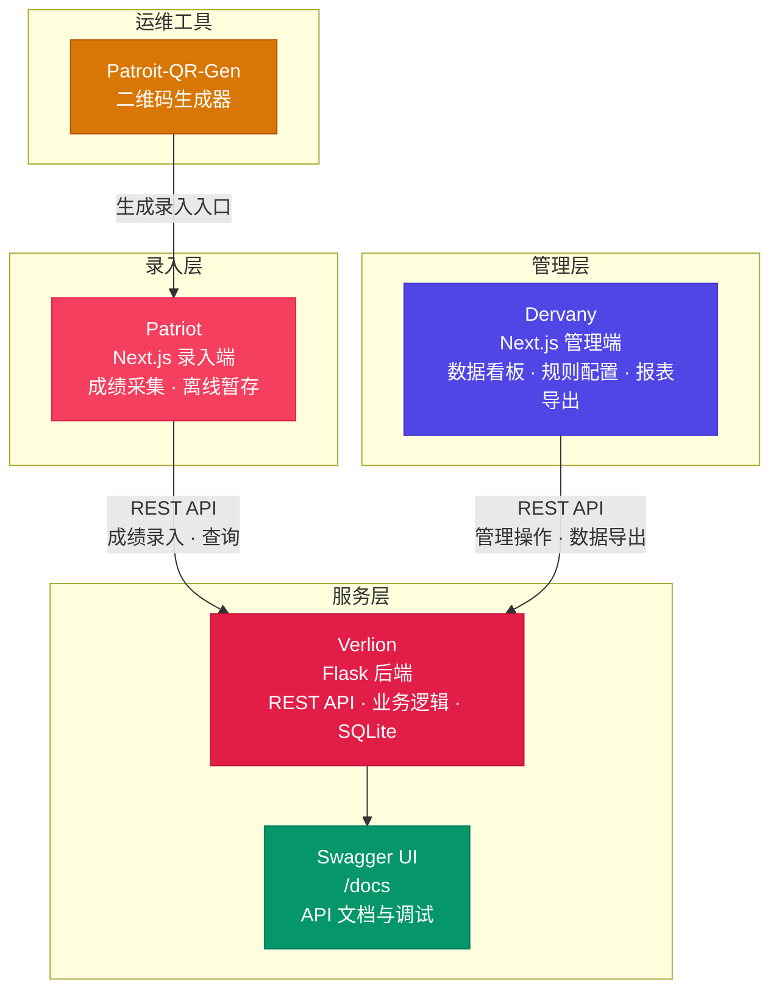
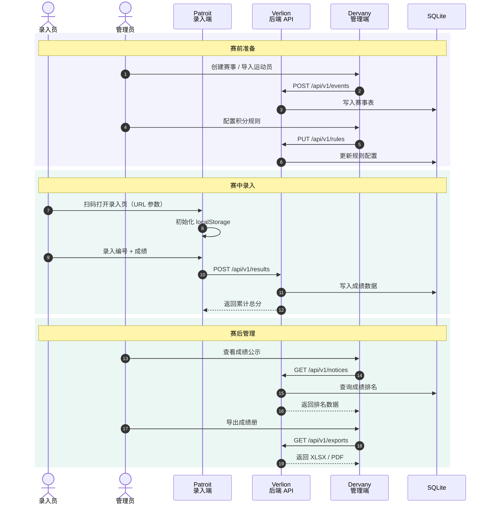

> 专业体育赛事智慧管理解决方案 —— 覆盖赛事录入、后端服务、管理运营全流程

::: tip 下载手册
<a href="https://github.com/CN-MRZZJ/RaySport/blob/main/RaySport-%E5%AE%A3%E4%BC%A0%E6%89%8B%E5%86%8C.md" target="_blank">📥 下载 Markdown 源文件（GitHub）</a>
:::


---

## 平台概览

锐赛体育智慧平台（RaySport）是一套面向校园及中小型体育赛事的全流程数字化管理解决方案。平台以"**录入端 → 后端 → 管理端**"三层解耦架构为核心，将赛事数据的采集、存储、运营三大环节有机串联，为赛事组织方提供从赛前编排到赛后成绩发布的端到端数字化能力。

### 三大子系统

| 子系统 | 定位 | 技术栈 | 用户 |
|--------|------|--------|------|
| **Patroit** · 录入端 | 赛事成绩采集前端 | Next.js 16 + React 19 + TypeScript | 赛事工作人员 / 裁判员 |
| **Verlion** · 后端 | 核心业务服务 | Flask + Python + SQLite | 系统（API 提供方） |
| **Dervany** · 管理端 | 赛事运营管理后台 | Next.js 16 + TypeScript + Tailwind CSS 4 | 赛事主管 / 系统管理员 |

**三个子系统各自独立部署、职责清晰，通过 REST API 协同工作。单端升级不影响整体运行。**



---

## 一、Patroit · 录入端

**定位：面向赛事一线工作人员的轻量级成绩录入前端**

?> 仓库地址：github.com/CN-MRZZJ/Patroit

### 技术构成

| 类别 | 选型 |
|------|------|
| 框架 | Next.js 16 + React 19 |
| 语言 | TypeScript |
| 样式 | Tailwind CSS 4 |
| 数据交互 | 对接 Verlion REST API |

### 核心功能

#### 1. 成绩录入

- **编号 + 成绩**双字段录入表单，操作极简
- 已录入成绩列表实时展示，带**跑动总分汇总**
- 录入数据持久化至 `localStorage`，**浏览器刷新不丢失**

#### 2. URL 参数化启动

通过 URL 查询参数一键初始化录入环境：

```
?init=操作员姓名&event_id=1&athlete_type=成人组
```

参数首次加载后自动存入本地存储，后续访问无需重复传递。适合赛场现场"扫码即用"的快速启动场景。


#### 3. 环境配置

| 变量 | 说明 |
|------|------|
| `NEXT_PUBLIC_API_ENDPOINT` | 后端 API 地址（指向 Verlion） |
| `NEXT_PUBLIC_ORG_NAME` | 组织名称 |

### 典型使用流程

1. 管理员通过 QR 码或链接下发录入入口（含 URL 参数）
2. 录入员打开页面，自动加载赛事、组别配置
3. 逐项录入运动员编号 + 成绩，实时查看累计总分
4. 数据经 Verlion API 持久化，管理端 Dervany 同步可见

<!-- Patroit 工作流截图待补充 -->

---

## 二、Verlion · 后端

**定位：平台核心业务引擎，提供 REST API 与数据持久化**

?> 仓库地址：github.com/CN-MRZZJ/Verlion

### 技术构成

| 类别 | 选型 |
|------|------|
| 框架 | Flask（Python 3.10+） |
| 数据库 | SQLite |
| 生产部署 | Waitress（Windows）/ Gunicorn（Linux） |
| API 规范 | RESTful，统一 JSON 响应 |
| 文档 | Swagger UI（`/docs`） |

### 核心功能

#### 1. 赛事项目管理

- 比赛项目完整 CRUD
- **项目类型动态管理**（`event_types` 表）：预置田径（track）、田赛（field）、趣味（fun）三类，可扩展自定义类型
- **项目状态流转追踪**：记录 → 排名 → 成绩录入 → 公示
- CSV 批量导入 / 导出

#### 2. 运动员管理

- 统一运动员库，分 **竞技组**（competitive）和 **趣味组**（fun）
- 支持 CSV 批量导入，可关联所属单位（A/B/C 部门等）
- 完整 CRUD 接口

#### 3. 成绩录入与多轮次支持

四种计分策略，覆盖所有比赛类型：

| 策略 | 说明 | 适用场景 |
|------|------|----------|
| `time` | 时间（秒） | 径赛：100m、200m、接力等 |
| `length` | 长度（米/厘米） | 田赛：跳远、跳高、铅球等 |
| `count` | 次数（越多越好） | 跳绳、投篮等计数项目 |
| `count_miss` | 失误次数（越少越好） | 射箭脱靶、障碍失误等 |

- 支持**多轮次 / 多次试跳试投**（attempt），取 **最佳成绩**（best）或 **最新成绩**（latest）
- 个人项目与团体项目**分开录入**

<!-- 待补充：Verlion 成绩录入逻辑示意图 -->

#### 4. 积分与排名计算

- **可配置积分规则**：个人 / 团体前 8 名对应积分，通过 `PUT /api/v1/rules` 动态调整
- 自动计算**运动员积分榜、部门积分榜**及多维度排名
- 重复计算检测：防止同一成绩重复积分

#### 5. 公示与导出

- 4 种公示模板：单人成绩、多人成绩、单轮次、多轮次
- 轮次公示支持 `?attempt_number=N` 参数筛选
- 统一动态模板机制（`row_template` + `start_row` + `max_rows`）
- **XLSX + PDF** 双格式导出预览
- 模板布局通过 JSON 配置文件自定义

#### 6. 数据安全

- 破坏性操作需**二次确认**（DELETE 需输入校验码、清空数据需 `CLEAR-N` 动态确认）
- 规则配置首次从 JSON 文件迁移至数据库，后续以 DB 为准

### API 响应规范

所有接口统一返回 JSON：

```json
// 成功
{ "ok": true, ...data }

// 失败（HTTP 400）
{ "ok": false, "error": "错误描述" }

// 分页
{ "ok": true, "items": [...], "total": 100, "page": 1, "page_size": 20 }
```

<!-- 待补充：Verlion API 架构 / Swagger UI 截图 -->

---

## 三、Dervany · 管理端

**定位：面向赛事运营管理人员的全功能后台**

?> 仓库地址：github.com/CN-MRZZJ/Dervany

### 技术构成

| 类别 | 选型 |
|------|------|
| 框架 | Next.js 16（App Router） |
| 语言 | TypeScript |
| 样式 | Tailwind CSS 4 |
| 图标 | Lucide React |
| 部署 | 静态导出（`out/`） + Nginx |

### 功能模块总览

| 模块 | 页面 | 说明 |
|------|------|------|
| **概览** | 首页仪表盘 | 赛况总览，核心指标一览 |
| **赛务** | 比赛进度 · 成绩录入 · 成绩公示 · 轮次成绩 | 核心赛务全流程 |
| **数据** | 导入中心 · 导出中心 | 数据批量流转 |
| **管理** | 运动员 · 队伍 · 单位 | 基础数据管理 |
| **系统** | 规则配置 · 清理数据 · 系统状态 | 系统配置与运维 |

### 模块详解

#### 1. 概览仪表盘

赛事核心指标集中展示：进行中赛事数、参赛人数、项目进度、成绩录入率等，管理者打开即掌握全局。


#### 2. 赛务模块

**比赛进度** — 查看各项目当前状态（记录 → 排名 → 成绩录入 → 公示），追踪整体赛事推进情况。

**成绩录入** — 管理员侧的成绩录入入口，与 Patroit 共享同一后端 API，适合集中式录入场景。

**成绩公示** — 审核并发布成绩，支持按项目、组别、轮次筛选查看。


**轮次成绩** — 按 `attempt_number` 筛选导出单轮成绩，支持 XLSX / PDF 预览。


#### 3. 数据导入 / 导出

- CSV 批量导入赛事项目、运动员、报名数据
- 数据导出支持筛选条件 + 格式选择
- 导入 / 导出中心统一管理所有数据流转

#### 4. 基础数据管理

- **运动员管理**：查看、搜索、编辑全部运动员信息，按竞技组/趣味组筛选


- **队伍管理**：管理参赛队伍（代表队/院系/班级等），查看队伍积分
- **单位管理**：维护参赛组织单元，支持批量添加

#### 5. 规则配置

**积分规则** — 个人 / 团体项目名次对应积分，支持**动态增删**，即时生效。

**成绩策略** — 项目类型（event-type）完整 CRUD：

| 属性 | 说明 |
|------|------|
| 代号 | 类型唯一标识 |
| 中文显示名 | 界面展示名称 |
| 比较策略 | `time` / `length` / `count` / `count_miss` |

通过 `/api/v1/event-types` 管理，前端无需硬编码。

**组别选项** — 运动员 / 项目的可选组别（如"成人组""学生组""教工组"），动态可配。

<!-- 待补充：Dervany 规则配置界面截图 -->

#### 6. 部署方式

项目配置为**静态导出模式**，编译后生成 `out/` 目录，可直接部署至 Nginx：

```bash
npm run build          # 编译到 out/
./deploy.sh 10.0.0.1  # 一键部署至服务器
```

内置 `nginx.conf` 包含 Gzip 压缩、缓存策略、SPA fallback 等生产环境最佳配置。

---

## 三端协同示意



| 阶段 | 关键交互 | 涉及接口 |
|------|----------|----------|
| 赛前准备 | Dervany 创建赛事、导入数据、配置规则 | `POST /events` `PUT /rules` `POST /imports` |
| 赛中录入 | Patroit 快速录入成绩，localStorage 兜底 | `POST /results` `GET /results` |
| 赛后管理 | Dervany 公示成绩、导出报表、归档数据 | `GET /notices` `GET /exports` `GET /views` |

<!-- 待补充：三端协同运行效果截图 -->

---

## 特色亮点

### 1. 即刻可用，零配置启动

三端均可本地一键启动：`npm run dev`（Patroit / Dervany）或 `python run_dev.py`（Verlion），SQLite 免安装，适合快速演示和中小型赛事直接投入使用。

### 2. 灵活的计分体系

不硬编码任何计分规则 — 项目类型、比较策略、积分规则全部通过 API 动态配置。应对不同赛事（田径运动会、趣味运动会、单项锦标赛）无需改代码。

### 3. 多轮次 + 多策略

完整支持田赛多轮试跳试投（取最佳/取最新）、径赛计时排名、计数项目的次数统计，覆盖绝大多数校园赛事场景。

### 4. 离线持久化录入

Patroit 端成绩数据写入 `localStorage`，网络波动不会丢失已录入数据，回车即存、刷新不丢，适合赛场边录入环境。

### 5. 公示与导出全链路

从成绩录入 → 排名计算 → 公示模板 → XLSX/PDF 导出，一气呵成。公示模板布局通过 JSON 可定制，适配不同组织方的表格规范。

### 6. 一键部署

Dervany 编译为纯静态文件 + Nginx 配置，`deploy.sh` 一键上传。Verlion 支持 Waitress / Gunicorn 双模式，Windows 和 Linux 均可部署。

---

## 技术能力一览

| | Patroit | Verlion | Dervany |
|------|---------|--------|---------|
| 语言 | TypeScript | Python 3.10+ | TypeScript |
| 框架 | Next.js 16 + React 19 | Flask | Next.js 16 |
| 样式 | Tailwind CSS 4 | — | Tailwind CSS 4 |
| 数据存储 | localStorage (本地暂存) | SQLite | —（调用 API） |
| API 交互 | 客户端直连 Verlion | 服务端提供 REST API | 客户端直连 Verlion |
| 部署 | `npm run build` + `npm start` | `python run_prod.py` / Gunicorn | 静态导出 + Nginx |

---

## 仓库地址

| 子系统 | GitHub |
|--------|--------|
| Patroit · 录入端 | https://github.com/CN-MRZZJ/Patroit |
| Verlion · 后端 | https://github.com/CN-MRZZJ/Verlion |
| Dervany · 管理端 | https://github.com/CN-MRZZJ/Dervany |
| 官网（本项目） | https://github.com/CN-MRZZJ/RaySport |

---

> 锐赛体育智慧平台 · RaySport — 让每一场赛事都数字化
