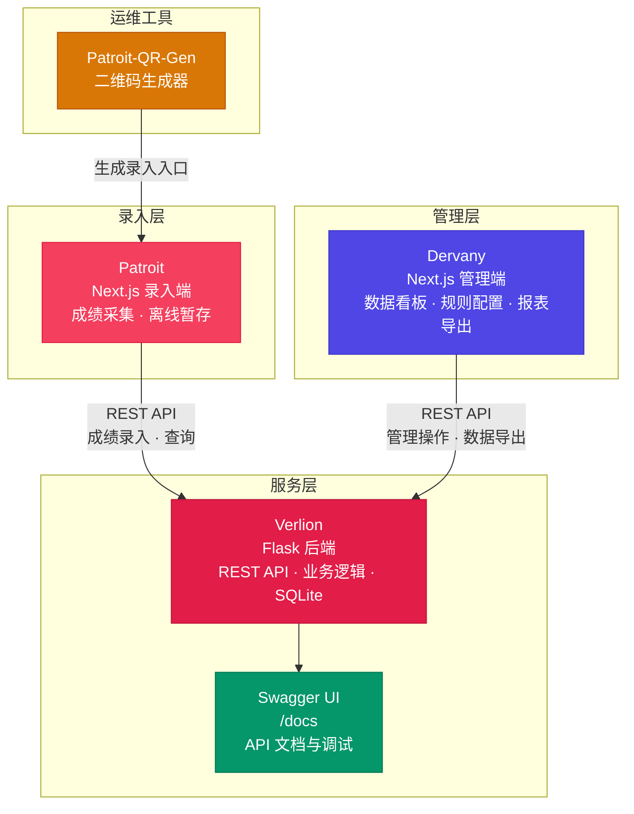

  <h2>三大核心子系统</h2>
  
锐赛体育智慧平台由三个协同工作的子系统组成，分别负责赛事数据的采集录入、后台服务的逻辑处理以及管理端的运营决策，构建完整的体育赛事数字化闭环。

  <a class="product-card" href="/patroit">
    

      
    

    <h3>Patroit</h3>
    
录入端 · Next.js 16 + TypeScript

    
轻量级成绩录入前端，编号+成绩双字段操作极简，URL 参数化启动，localStorage 离线持久化，适合赛场扫码即用。

    了解更多 →
  </a>
  <a class="product-card" href="/verlion">
    

      
    

    <h3>Verlion</h3>
    
后端 · Flask + Python + SQLite

    
核心业务引擎，4 种计分策略、多轮次支持、积分自动计算、公示模板导出，统一 JSON 响应规范。

    了解更多 →
  </a>
  <a class="product-card" href="/dervany">
    

      
    

    <h3>Dervany</h3>
    
管理端 · Next.js 16 + TypeScript

    
赛事运营管理后台，概览仪表盘、赛务流程、数据导入导出、规则配置、运动员管理，静态导出 + Nginx 部署。

    了解更多 →
  </a>

---

## 平台概述

锐赛体育智慧平台（RaySport）是一套面向校园及中小型体育赛事的全流程数字化管理解决方案。平台采用"**录入端 → 后端 → 管理端**"三层解耦架构，将赛事数据的采集、存储、运营三大环节有机串联，为赛事组织方提供从赛前编排到赛后成绩发布的端到端数字化能力。

### 架构总览

::: tip 架构说明
Patroit（录入端）负责赛事成绩采集与录入，通过 Verlion（后端）提供的 REST API 将数据持久化至 SQLite，Dervany（管理端）则基于同一后端服务，面向管理员提供可视化的运营管理界面。三端各司其职，独立部署，通过统一的后端 API 协同工作。
:::

### 三种角色，一个平台

| 角色 | 使用端 | 核心职责 |
|------|--------|----------|
| **赛事工作人员 / 裁判员** | Patroit · 录入端 | 成绩现场录入、实时查看累计总分 |
| **赛事主管 / 系统管理员** | Dervany · 管理端 | 赛事运营、数据看板、规则配置、报表导出 |
| **运动员 / 观众** | 对外展示（规划中） | 赛事信息查询、成绩查看、赛程浏览 |

### 核心优势

**即刻可用，零配置启动** — 三端均可本地一键启动，SQLite 免安装数据库，适合快速演示和中小型赛事直接投入使用。

**三层解耦架构** — 录入端、后端、管理端独立部署，职责清晰，易于维护和扩展，单端升级不影响整体运行。

**灵活的计分体系** — 项目类型、比较策略、积分规则全部通过 API 动态配置。不硬编码任何规则，应对不同赛事无需改代码。

**公示与导出全链路** — 从成绩录入 → 排名计算 → 公示模板 → XLSX/PDF 导出，一气呵成。模板布局通过 JSON 可定制。

### 技术选型

| 子系统 | 语言 | 框架 | 数据存储 | 部署 |
|--------|------|------|----------|------|
| Patroit · 录入端 | TypeScript | Next.js 16 + React 19 | localStorage (本地暂存) | `npm run build` + `npm start` |
| Verlion · 后端 | Python 3.10+ | Flask | SQLite | Waitress / Gunicorn |
| Dervany · 管理端 | TypeScript | Next.js 16 (App Router) | — (调用 API) | 静态导出 + Nginx |

### 宣传手册

完整平台介绍、功能详解、三端协同示意，可下载 Markdown 源文件离线阅读。

<a class="download-brochure" href="/brochure">📥 查看宣传手册</a>

